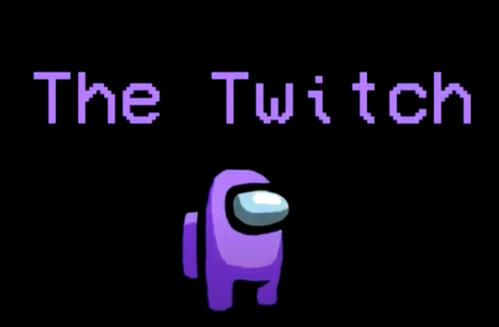
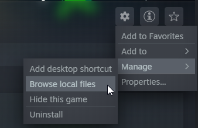
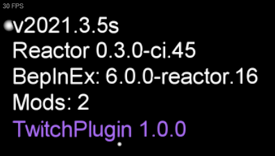

[![Contributors][contributors-shield]][contributors-url]
[![Forks][forks-shield]][forks-url]
[![Stargazers][stars-shield]][stars-url]
[![Issues][issues-shield]][issues-url]
[![MIT License][license-shield]][license-url]
<!-- [![LinkedIn][linkedin-shield]][linkedin-url] -->

<!-- PROJECT LOGO -->
 

  
  <h3 align="center">Among Us Twitch Mod</h3>

  

    An Among Us mod that allows twitch viewers to interact with your game via channel points
     
    <a href="https://github.com/TheRamik/Among-Us-Twitch-Mod"><strong>Explore the docs »</strong></a>
     
     
    <a href="https://github.com/TheRamik/Among-Us-Twitch-Mod">View Demo</a>
    ·
    <a href="https://github.com/TheRamik/Among-Us-Twitch-Mod/issues">Report Bug</a>
    ·
    <a href="https://github.com/TheRamik/Among-Us-Twitch-Mod/issues">Request Feature</a>
  

<!-- TABLE OF CONTENTS -->

  
<h2 style="display: inline-block">Table of Contents</h2>

  <ol>
    <li>
      <a href="#about-the-project">About The Project</a>
      <ul>
        <li><a href="#built-with">Built With</a></li>
      </ul>
    </li>
    <li>
      <a href="#getting-started">Getting Started</a>
      <ul>
        <li><a href="#prerequisites">Prerequisites</a></li>
        <li><a href="#installation">Installation</a></li>
        <li><a href="#streamer-installation">Installation (Streamers Only)</a></li>
      </ul>
    </li>
    <li><a href="#building">Building</a></li>
    <li><a href="#roadmap">Roadmap</a></li>
    <li><a href="#contributing">Contributing</a></li>
    <li><a href="#license">License</a></li>
    <li><a href="#contact">Contact</a></li>
    <li><a href="#acknowledgements">Acknowledgements</a></li>
  </ol>

## About The Project

This is a mod that allows a Twitch broadcaster's viewers to interact with their Among Us game via Channel Points.

Once set up, this mod will allow Twitch viewers to
* Kill a random player
* Swap positions of all living players

This mod was originally created by [Efren Aguilar](https://github.com/efrenaguilar95) and [Ricky Tham](https://github.com/TheRamik) as part of the [2021 Twitch Channel Point Hackathon.](https://twitchchannelpoints.devpost.com/)

### Built With

* [Twitch API](https://dev.twitch.tv/docs/api/)
* [TwitchLib](https://github.com/TwitchLib/TwitchLib)
* [Reactor](https://github.com/NuclearPowered/Reactor)
* [Harmony](https://github.com/pardeike/Harmony)
* [BepInEx](https://github.com/BepInEx/BepInEx)

## Getting Started

To get the game mod working will require a few steps, as shown below. Streamers will also need to set up the TwitchLib application, instructions for that can be found [here.](https://github.com/TheRamik/Among-Us-Twitch-Mod/tree/main/AUTwitchNetwork)

### Prerequisites

In order to play this mod online, a custom/private server is needed. Using [Impostor](https://github.com/Impostor/Impostor) is probably the easiest way to do this. Before doing anything else, it is highly recommended to get that set up first since this mod will not work without it.

Instructions and downloads for this are linked below, as well as a useful video for those who may need it.

* [Impostor Github](https://github.com/Impostor/Impostor)
* [Video Guide](https://www.youtube.com/watch?v=6_1hx9DdM88) big shout out to [TroubleChute](https://www.youtube.com/channel/UCkih2oVTbXPEpVwE-U7kmHw) for making this!

### Installation

Players will need to download the latest "AmongUsTwitchMod" zip folder found [here.](https://github.com/TheRamik/Among-Us-Twitch-Mod/releases)

Once there, open up the Among Us game files/folder. If you have the game on Steam, the easiest way is to do this via the settings button for Among Us.

Inside here, unzip the contents of the zip folder. It should then look similar to what is shown above.

Then try running the game. It may take some time to launch the first time, but that's normal. If you see something like what is shown above, you have successfully installed the mod!

<section id="streamer-installation">

### Installation (Streamers Only)

If you are a streamer, you will also need to install the TwitchLib program. Instructions for that can be found [here.](https://github.com/TheRamik/Among-Us-Twitch-Mod/tree/main/AUTwitchNetwork)

</section>

## Building

To build the Among Us mod for this project, you will need to creator a [Reactor](https://github.com/NuclearPowered/Reactor) development environment. Instructions for this can be found [here.](https://docs.reactor.gg/)

To build the TwitchLib program, follow the instructions [here.](https://github.com/TheRamik/Among-Us-Twitch-Mod/tree/main/AUTwitchNetwork)

## Roadmap

See the [open issues](https://github.com/TheRamik/Among-Us-Twitch-Mod/issues) for a list of proposed features (and known issues).

## Contributing

Contributions are what make the open source community such an amazing place to be learn, inspire, and create. Any contributions you make are greatly appreciated.

1. Fork the Project
2. Create your Feature Branch (`git checkout -b feature/AmazingFeature`)
3. Commit your Changes (`git commit -m 'Add some AmazingFeature'`)
4. Push to the Branch (`git push origin feature/AmazingFeature`)
5. Open a Pull Request

<!-- LICENSE -->
## License

Distributed under the MIT License. See [LICENSE](https://github.com/TheRamik/Among-Us-Twitch-Mod/blob/main/LICENSE) for more information.

## Contact

For any mod issues, please see the [open issues](https://github.com/TheRamik/Among-Us-Twitch-Mod/issues) to check if someone else is having the same issue as you, or even a solution! Otherwise, feel free to post your issue there.

If you want to see the mod played live, follow [Rickelz_](https://www.twitch.tv/rickelz_) on Twitch!

Project Link: [https://github.com/TheRamik/Among-Us-Twitch-Mod](https://github.com/TheRamik/Among-Us-Twitch-Mod)

<!-- ACKNOWLEDGEMENTS -->
## Acknowledgements

* [Twitch](https://www.twitch.tv/) and the [2021 Twitch Channel Point Hackathon](https://twitchchannelpoints.devpost.com/) for driving us to make this
* The [GTA V Chaos Mod]() which was a big source of inspiration for this mod
* The Among Us modding community for helping us dive into the world of Among Us mods
* [Best-README-Template](https://github.com/othneildrew/Best-README-Template) for readme/markdown guidance
* All the people who made the [tools](#built-with) used in this project

<!-- MARKDOWN LINKS & IMAGES -->
<!-- https://www.markdownguide.org/basic-syntax/#reference-style-links -->
[contributors-shield]: https://img.shields.io/github/contributors/TheRamik/Among-Us-Twitch-Mod.svg?style=for-the-badge
[contributors-url]: https://github.com/TheRamik/Among-Us-Twitch-Mod/graphs/contributors
[forks-shield]: https://img.shields.io/github/forks/TheRamik/Among-Us-Twitch-Mod.svg?style=for-the-badge
[forks-url]: https://github.com/TheRamik/Among-Us-Twitch-Mod/network/members
[stars-shield]: https://img.shields.io/github/stars/TheRamik/Among-Us-Twitch-Mod.svg?style=for-the-badge
[stars-url]: https://github.com/TheRamik/Among-Us-Twitch-Mod/stargazers
[issues-shield]: https://img.shields.io/github/issues/TheRamik/Among-Us-Twitch-Mod.svg?style=for-the-badge
[issues-url]: https://github.com/TheRamik/Among-Us-Twitch-Mod/issues
[license-shield]: https://img.shields.io/github/license/TheRamik/Among-Us-Twitch-Mod.svg?style=for-the-badge
[license-url]: https://github.com/TheRamik/Among-Us-Twitch-Mod/blob/master/LICENSE.txt
<!-- [linkedin-shield]: https://img.shields.io/badge/-LinkedIn-black.svg?style=for-the-badge&logo=linkedin&colorB=555
[linkedin-url]: https://linkedin.com/in/TheRamik -->
